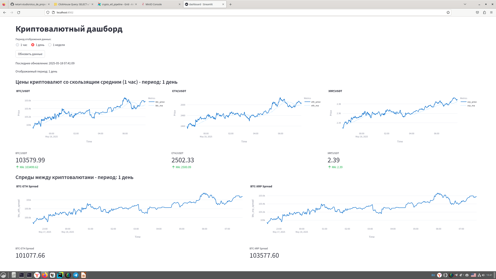
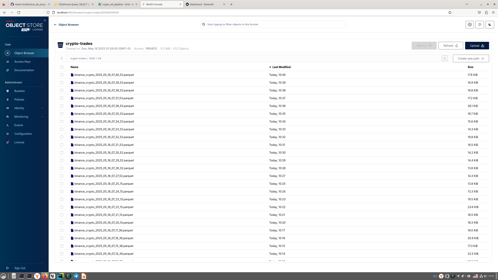
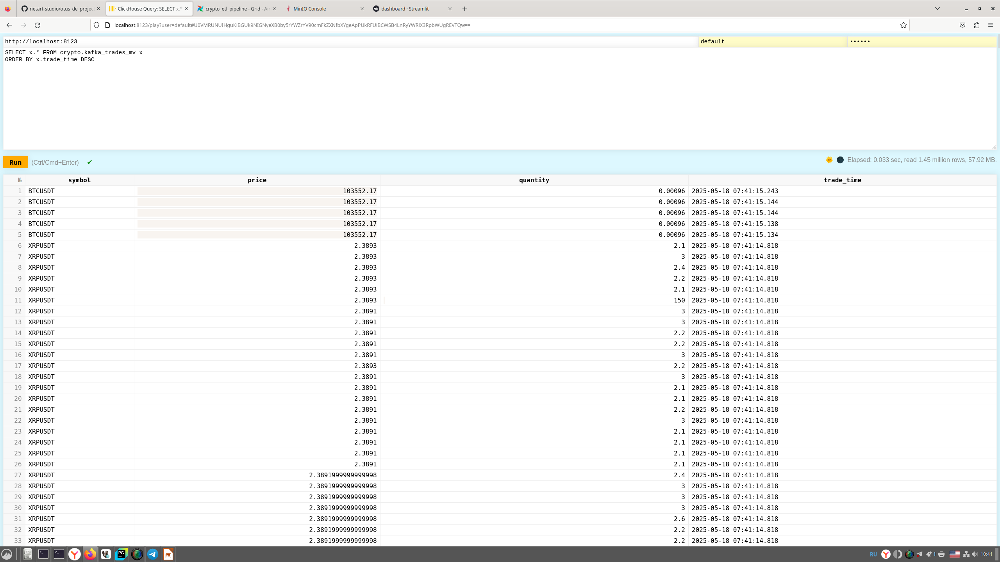

# Курсовой проект по курсу Otus Дата Инженер.
## Сбор и анализ потоковых данных криптовалют

## Описание

Проект представляет собой систему для сбора и визуализации 
потоковых данных по криптовалютам. Система состоит из нескольких компонентов:

1. **Producer** - собирает данные о сделках с Binance через WebSocket
2. **Kafka** - промежуточное хранилище для потоковых данных
3. **S3 Minio** - хранилище сырых данных в формате parquet, Stage Layer
4. **ClickHouse** - хранение витрин, Data Mart Layer
5. **Metabase / Stremlit** - BI, веб-интерфейс для построения Dashboard

## Требования

- Docker 20.10+
- Docker Compose 2.0+
- 16GB RAM (минимум)
- 20GB свободного места на диске

## Версии ПО
- Python 3.12
- Kafka 7.4.0
- Minio 8.5.1+
- ClickHouse 23.9.5+

## Архитектура


### Компоненты

1. **Producer (producer.py)**
   - Подключается к Binance WebSocket API
   - Собирает данные о сделках BTC/USDT, ETH/USDT и XRP/USDT 
   - Отправляет данные в Kafka

2. **Kafka**
   - Промежуточное хранилище для потоковых данных о сделках
   - Обеспечивает буферизацию данных

3. **S3 Minio**
   - Хранит сырые данные, Stage Layer

 
4. **ClickHouse**
   - Хранит витрину даных, Data Mart Layer

5. **BI - Metabase / Streamlit**
   - Dashboard, отображает графики котировок и спреды крипто валют.

## Запуск проекта

1. **Клонирование репозитория**
   ```bash
   git clone https://github.com/netart-studio/otus_de_project
   cd otus_de_project
   ```

2. **Запуск всех сервисов**
   ```bash
   docker-compose up -d
   ```

3. **Проверка статуса сервисов**
   ```bash
   docker-compose ps
   ```

## Доступ к сервисам

### Веб-интерфейсы

1. **MinIO (Object Storage)**
   - API Endpoint: http://localhost:9003
   - Web Console: http://localhost:9002
   - Credentials:
     - Username: minioadmin
     - Password: minioadmin

2. **ClickHouse**
   - HTTP Interface: http://localhost:8123
   - Native Interface: localhost:9001
   - Credentials:
     - Username: default
     - Password: secret
     - Database: crypto

3**Streamlit Dashboard**
   - URL: http://localhost:8502

### Kafka

- Bootstrap Servers:
  - Внутри Docker: kafka:29092
  - Снаружи: localhost:9092
- Zookeeper: localhost:2181

## Остановка проекта

```bash
docker-compose down
```

Для полной очистки данных (включая volumes):
```bash
docker-compose down -v
```
## Демонстрация проекта
## BI, dashboard 


## S3 minio


## ClickHouse


## Презентация
[Скачать Презентацию](https://github.com/netart-studio/otus_de_project/raw/refs/heads/main/docs/presentation_project.pptx )


## 🎥 Видео демонстрация
[Скачать видео демонстрацию](https://github.com/netart-studio/otus_de_project/raw/refs/heads/main/docs/de_project_demo.mp4" )

<details>
  <summary>Посмотреть видео с Rutube</summary>
  <br>
  <iframe 
    src="https://rutube.ru/video/private/55ce11a5964923c23b07ff2bd6c6a357/?p=TrLgH1KOx4PR7X97mXAlSg " 
    width="640" 
    height="360" 
    frameborder="0" 
    allowfullscreen>
  </iframe>
</details>