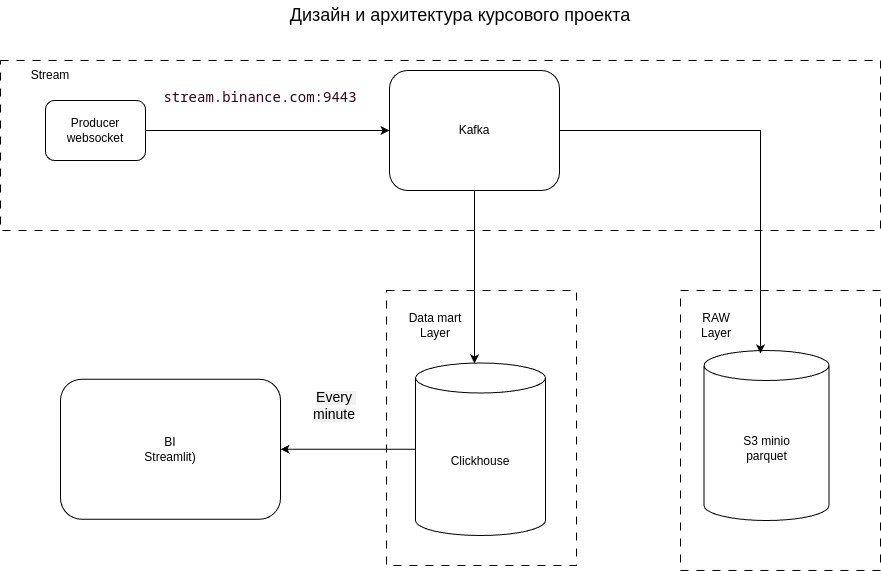

# Курсовой проект по курсу Otus Дата Инженер.
## Сбор и анализа потоковых данных криптовалют

## Описание

Проект представляет собой систему для сбора и визуализации 
потоковых данных по криптовалютам. Система состоит из нескольких компонентов:

1. **Producer** - собирает данные о сделках с Binance через WebSocket
2. **Kafka** - промежуточное хранилище для потоковых данных
3. **S3 Minio** - хранилище сырых данных в формате parquet, Stage Layer
4. **Airflow / Dagster** - ETL, перекладывает данные из Stage в Data Mart
5. **ClickHouse** - хранение витрин, Data Mart Layer
6. **Metabase / Stremlit** - BI, веб-интерфейс для построения Dashboard

## Требования

- Docker 20.10+
- Docker Compose 2.0+
- 16GB RAM (минимум)
- 20GB свободного места на диске

## Версии ПО
- Python 3.12
- Kafka 7.4.0
- Minio 8.5.1+
- Airflow 2.10.3+
- ClickHouse 23.9.5+

## Архитектура

### Компоненты

1. **Producer (producer.py)**
   - Подключается к Binance WebSocket API
   - Собирает данные о сделках BTC/USDT
   - Отправляет данные в Kafka

2. **Kafka**
   - Топик: binance_trades
   - Хранит сырые данные о сделках
   - Обеспечивает буферизацию данных

3. **S3 Minio**
   - Хранит сырые данные, Stage Layer

4. **ETL Airflow**
   - Перекладывает инкрементно данные из Stage в Data Mart
 
5. **ClickHouse**
   - Хранит витрину даных, Data Mart Layer

6. **BI - Metabase / Streamlit**
   - Dashboard, отображает графики котировок и спреды крипто валют.

